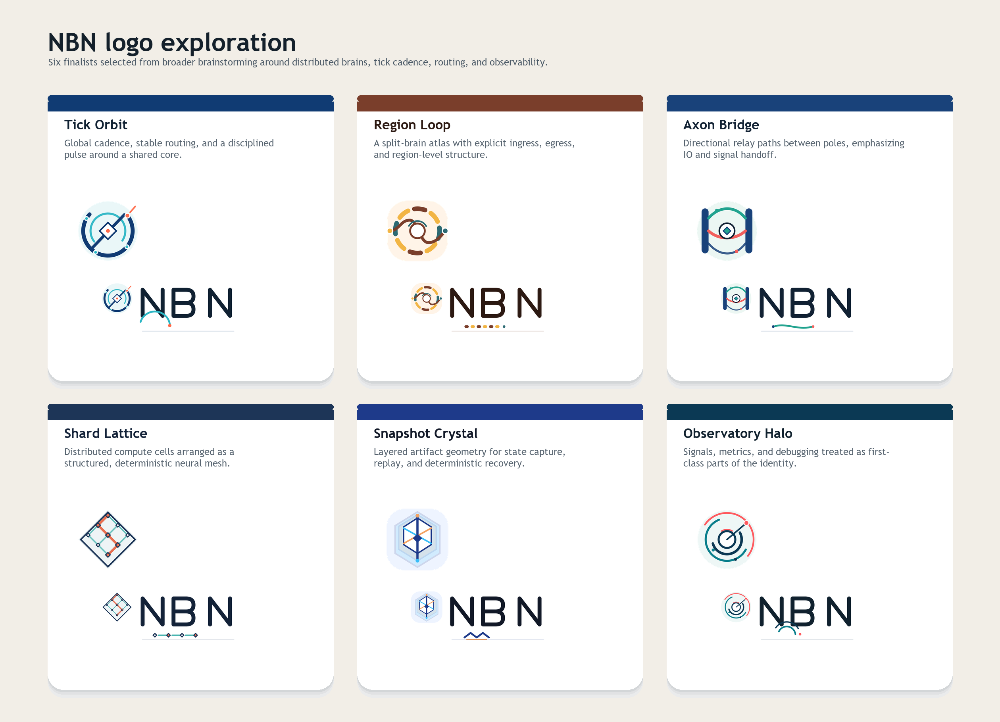

# NBN Logo Exploration

This workspace explores possible `NBN` identity directions without any `v2` language.

## Latest round

The current exploration is in [round8/README.md](round8/README.md). It pins `55deg Even Flow` and `55deg Exit Reach`, explores route blends between them, and adds `NBN` wordmark experiments around stroke weight, `B` width, and color.

The previous route-only study remains in [round7/README.md](round7/README.md).

The previous corrected rotation study remains in [round6/README.md](round6/README.md).

The previous attempt remains in [round5/README.md](round5/README.md).

The previous micro-variation pack remains in [round4/README.md](round4/README.md). It focuses only on `Loop Modernized` and `Segmented Diamond`.

The previous broader exploration remains in [round3/README.md](round3/README.md). It narrows the work to Region Seal, old Region Loop, and old Shard Lattice, then spreads the options from conservative refinements through broader hybrids.

The previous round remains in [round2/README.md](round2/README.md).



## Brand cues

- Distributed brains, not a monolithic AI blob.
- Global tick cadence and deterministic pacing.
- Routed signals across regions, shards, and gateways.
- Observability as a first-class part of the system.
- Explicitly not gradient-descent / backprop branding language.

## Broader brainstorm that got narrowed down

These directions were considered and intentionally dropped before rendering finalists:

- Literal brain silhouettes: too generic and too close to commodity AI branding.
- Neural chips / circuit boards: reads as hardware or inference silicon instead of distributed runtime orchestration.
- DNA / biotech motifs: points in the wrong domain.
- Infinity loops / generic node webs: common startup shapes with weak NBN-specific meaning.
- Pure monogram only: too abstract for a first identity pass.

## Finalists

### Tick Orbit

- Idea: global cadence, stable routing, disciplined pulse.
- Assets:
  - [Icon SVG](svg/nbn-tick-orbit-icon.svg)
  - [Icon PNG](png/nbn-tick-orbit-icon.png)
  - [Logo SVG](svg/nbn-tick-orbit-logo.svg)
  - [Logo PNG](png/nbn-tick-orbit-logo.png)

### Region Loop

- Idea: regions, ingress/egress, and explicit routing through a split topology.
- Assets:
  - [Icon SVG](svg/nbn-region-loop-icon.svg)
  - [Icon PNG](png/nbn-region-loop-icon.png)
  - [Logo SVG](svg/nbn-region-loop-logo.svg)
  - [Logo PNG](png/nbn-region-loop-logo.png)

### Axon Bridge

- Idea: directional relay between poles with a clear signal handoff story.
- Assets:
  - [Icon SVG](svg/nbn-axon-bridge-icon.svg)
  - [Icon PNG](png/nbn-axon-bridge-icon.png)
  - [Logo SVG](svg/nbn-axon-bridge-logo.svg)
  - [Logo PNG](png/nbn-axon-bridge-logo.png)

### Shard Lattice

- Idea: distributed compute cells forming a structured neural mesh.
- Assets:
  - [Icon SVG](svg/nbn-shard-lattice-icon.svg)
  - [Icon PNG](png/nbn-shard-lattice-icon.png)
  - [Logo SVG](svg/nbn-shard-lattice-logo.svg)
  - [Logo PNG](png/nbn-shard-lattice-logo.png)

### Snapshot Crystal

- Idea: layered artifacts, state capture, replay, and recovery.
- Assets:
  - [Icon SVG](svg/nbn-snapshot-crystal-icon.svg)
  - [Icon PNG](png/nbn-snapshot-crystal-icon.png)
  - [Logo SVG](svg/nbn-snapshot-crystal-logo.svg)
  - [Logo PNG](png/nbn-snapshot-crystal-logo.png)

### Observatory Halo

- Idea: telemetry, debugging, and signal visibility as part of the brand.
- Assets:
  - [Icon SVG](svg/nbn-observatory-halo-icon.svg)
  - [Icon PNG](png/nbn-observatory-halo-icon.png)
  - [Logo SVG](svg/nbn-observatory-halo-logo.svg)
  - [Logo PNG](png/nbn-observatory-halo-logo.png)

## Regeneration

Install the local renderer once, then regenerate all assets:

```powershell
npm install --prefix docs/branding
python docs/branding/generate_assets.py
```
