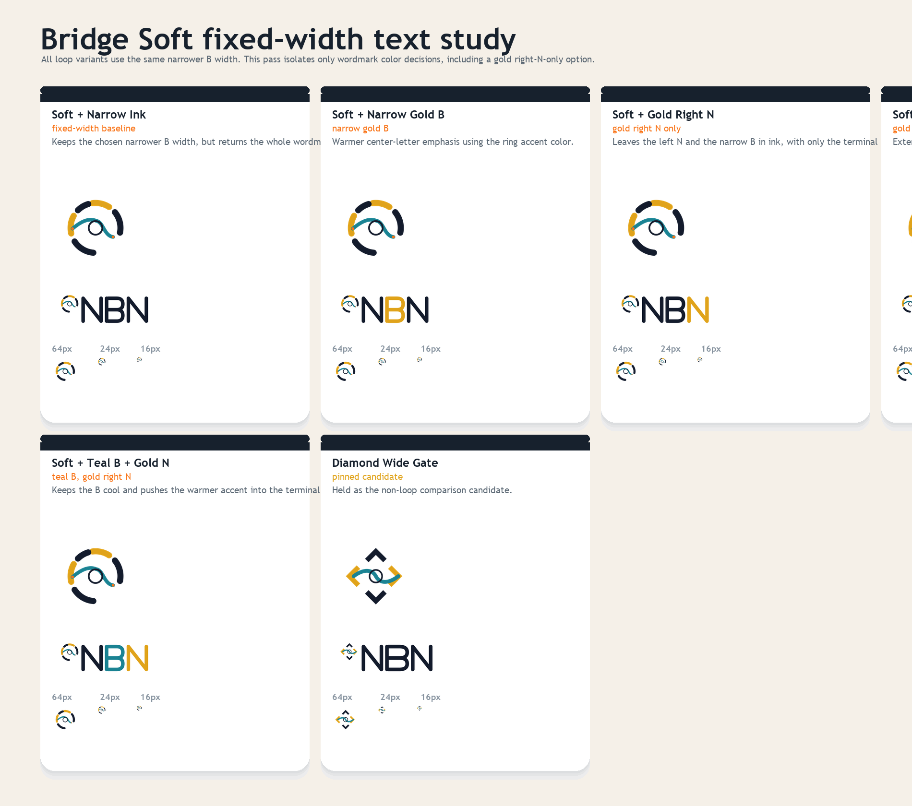
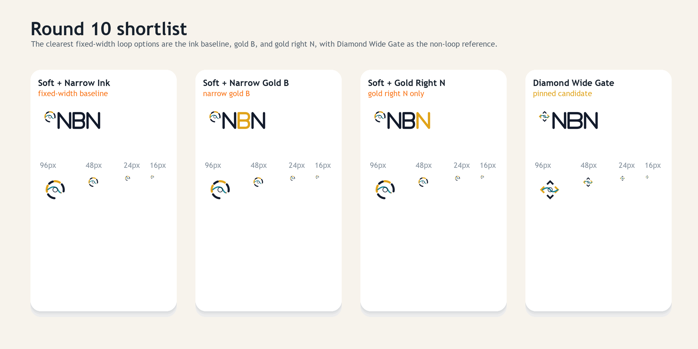

# NBN Logo Exploration Round 10

Round ten rebuilds the Bridge Soft wordmark pass as a cleaner fixed-width color study.

Focus areas:

- one chosen narrower `B` width across all loop variants
- a gold right-`N` only variant
- single-accent wordmark options
- teal and gold split-wordmark tests

`Diamond Wide Gate` remains pinned as the non-loop comparison candidate.





## Variants

- `Soft + Narrow Ink`
- `Soft + Narrow Gold B`
- `Soft + Gold Right N`
- `Soft + Gold B + Gold N`
- `Soft + Teal B + Gold N`

## Current shortlist

The strongest set in this pass is:

- `Soft + Narrow Ink`
- `Soft + Narrow Gold B`
- `Soft + Gold Right N`

`Diamond Wide Gate` remains pinned for comparison.

## Regeneration

From the repo root:

```powershell
python docs/branding/round10/generate_assets.py
```
