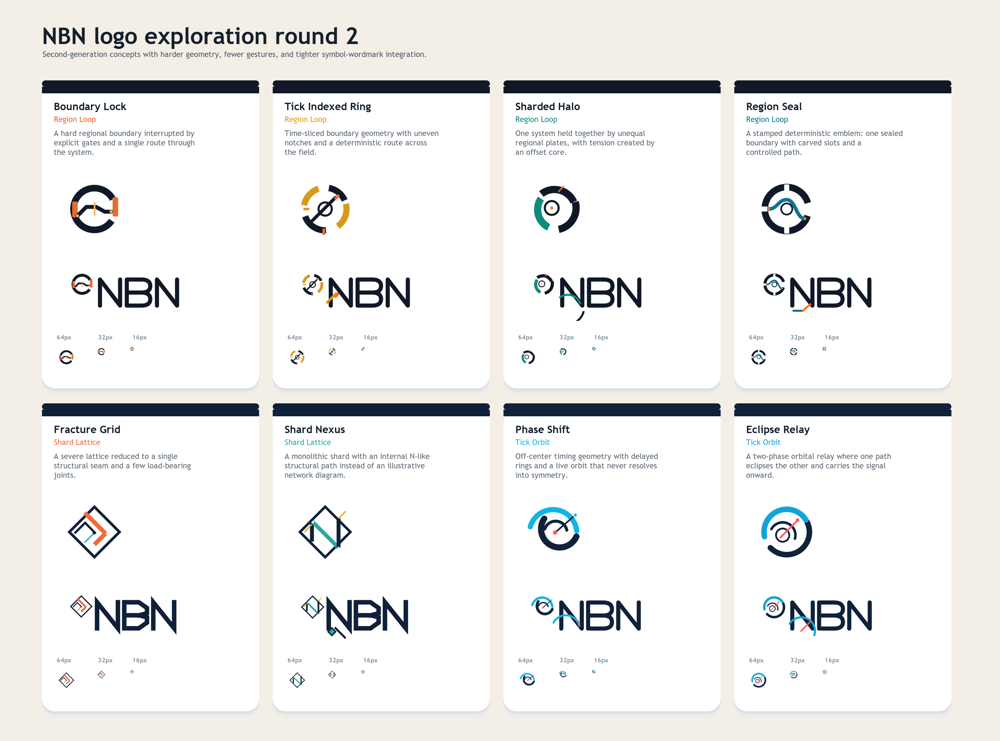
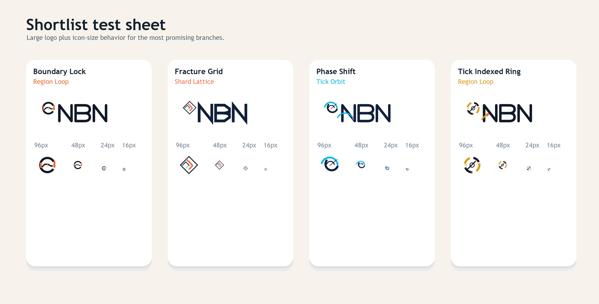

# NBN Logo Exploration Round 2

Second-generation exploration focused on stronger silhouettes, fewer gestures, and tighter symbol/wordmark integration.





## Focus

This round concentrates on:

- Region Loop descendants first
- Shard Lattice descendants second
- Tick Orbit descendants third

All mark text remains `NBN`.

## Design rules for this round

- One dominant gesture per mark
- Harder geometry and higher contrast
- Less garnish under or around the wordmark
- Better behavior at small icon sizes
- Clearer symbol-wordmark relationship

## Families

### Region Loop descendants

- `Boundary Lock`: hard loop with explicit gates and a controlled route
- `Tick Indexed Ring`: deterministic ring built from uneven time slices
- `Sharded Halo`: unequal regional plates held in one field
- `Region Seal`: a stamped boundary with carved slots

### Shard Lattice descendants

- `Fracture Grid`: reduced lattice with one structural seam
- `Shard Nexus`: monolithic shard with an internal N-like path

### Tick Orbit descendants

- `Phase Shift`: off-center cadence with delayed rings
- `Eclipse Relay`: two-phase orbital relay

## Current shortlist

After two render-and-critique passes, the strongest marks in this round are:

- `Boundary Lock`
- `Fracture Grid`
- `Phase Shift`
- `Tick Indexed Ring`

## Assets

Each concept has:

- `svg/nbn-<slug>-icon.svg`
- `svg/nbn-<slug>-logo.svg`
- `png/nbn-<slug>-icon.png`
- `png/nbn-<slug>-logo.png`

## Regeneration

From the repo root:

```powershell
npm install --prefix docs/branding
python docs/branding/round2/generate_assets.py
```
