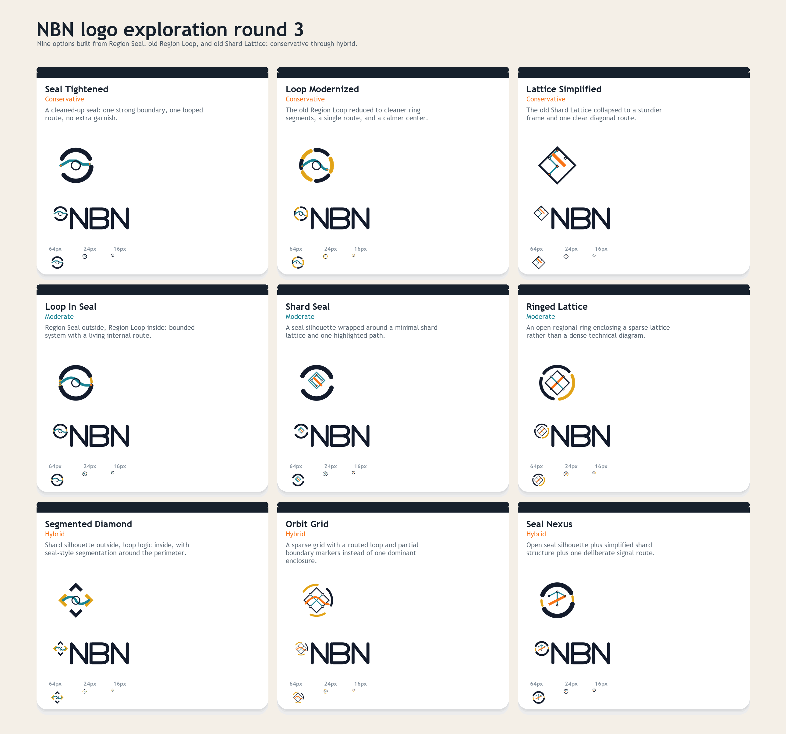
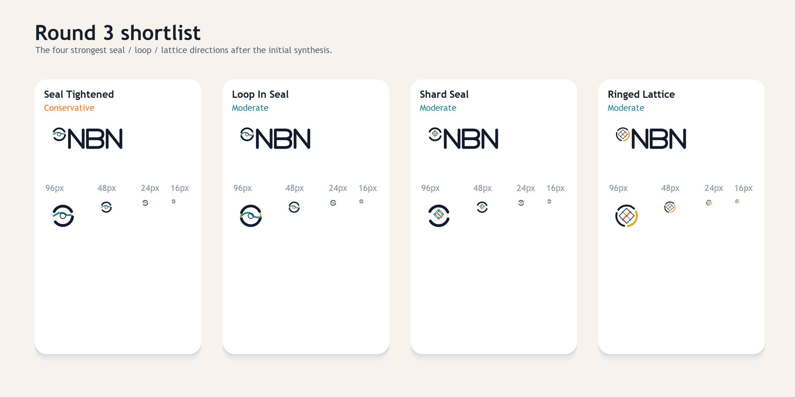

# NBN Logo Exploration Round 3

Round three narrows the work to three ingredients the previous rounds did not fully lose:

- `Region Seal`
- old `Region Loop`
- old `Shard Lattice`

This set is arranged as an array from conservative refinement to broader hybrid exploration.





## Bands

### Conservative

- `Seal Tightened`
- `Loop Modernized`
- `Lattice Simplified`

### Moderate

- `Loop In Seal`
- `Shard Seal`
- `Ringed Lattice`

### Hybrid

- `Segmented Diamond`
- `Orbit Grid`
- `Seal Nexus`

## Current shortlist

After the render-and-refine pass, the strongest four in this round are:

- `Seal Tightened`
- `Loop In Seal`
- `Shard Seal`
- `Ringed Lattice`

## Notes

- The wordmark is fixed in this round so the comparison stays focused on symbol direction.
- The weak under-text / underline treatment from earlier rounds is intentionally gone.
- The broadest recommendation from this round is still: seal silhouette plus either loop or lattice logic, but not both at full complexity.

## Regeneration

From the repo root:

```powershell
python docs/branding/round3/generate_assets.py
```
