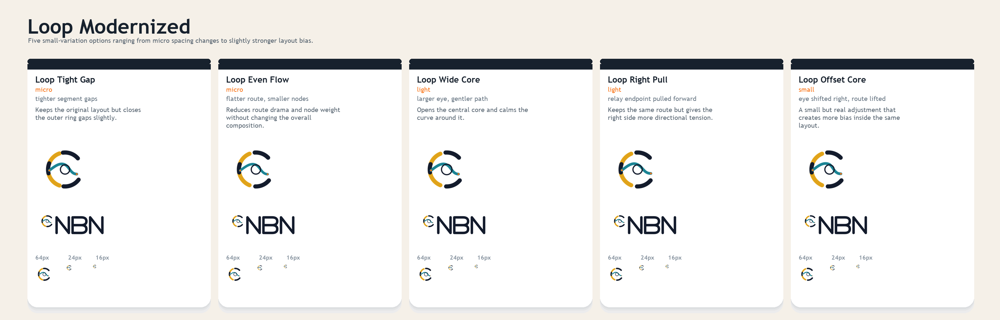
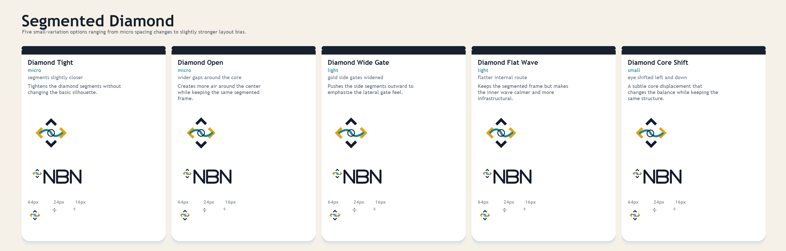
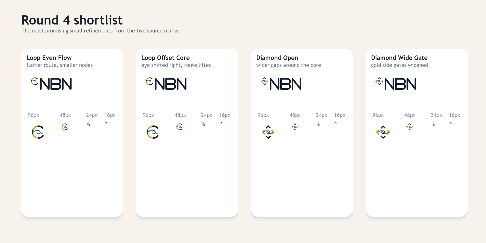

# NBN Logo Exploration Round 4

Round four is a micro-variation pack only. It sticks to:

- `Loop Modernized`
- `Segmented Diamond`

No new concept families were introduced. The goal is to compare small spacing, alignment, proportion, and route-shape changes without losing the original layouts.







## Families

### Loop Modernized variants

- `Loop Tight Gap`
- `Loop Even Flow`
- `Loop Wide Core`
- `Loop Right Pull`
- `Loop Offset Core`

### Segmented Diamond variants

- `Diamond Tight`
- `Diamond Open`
- `Diamond Wide Gate`
- `Diamond Flat Wave`
- `Diamond Core Shift`

## Current shortlist

The strongest small refinements in this round are:

- `Loop Even Flow`
- `Loop Offset Core`
- `Diamond Open`
- `Diamond Wide Gate`

## Regeneration

From the repo root:

```powershell
python docs/branding/round4/generate_assets.py
```
