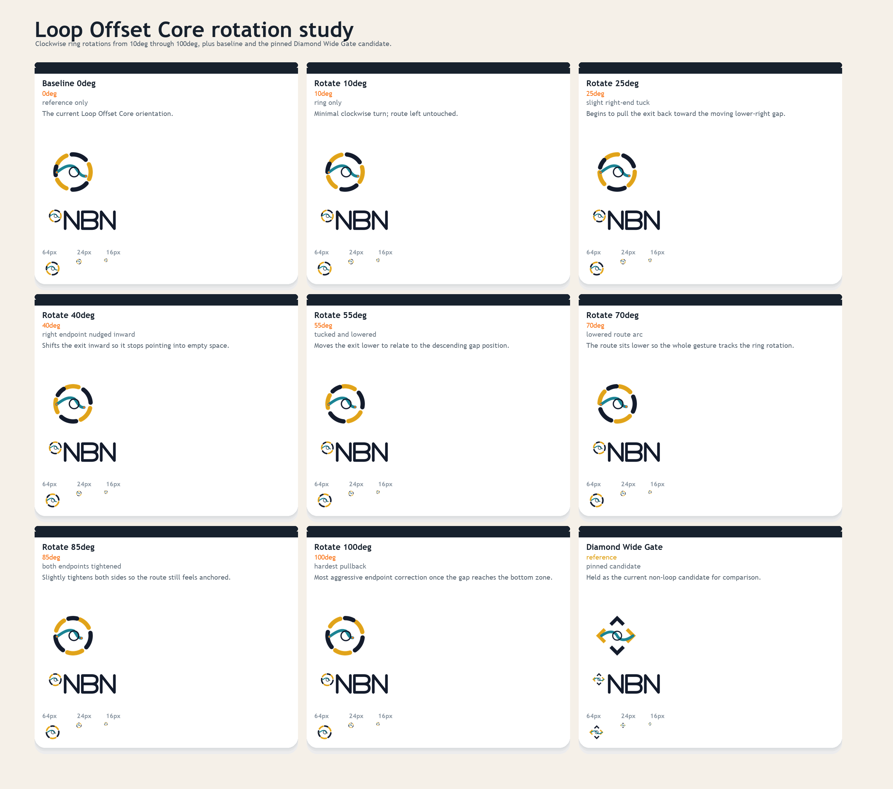
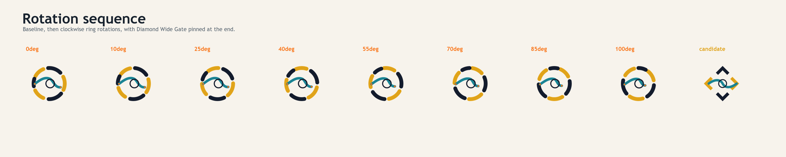
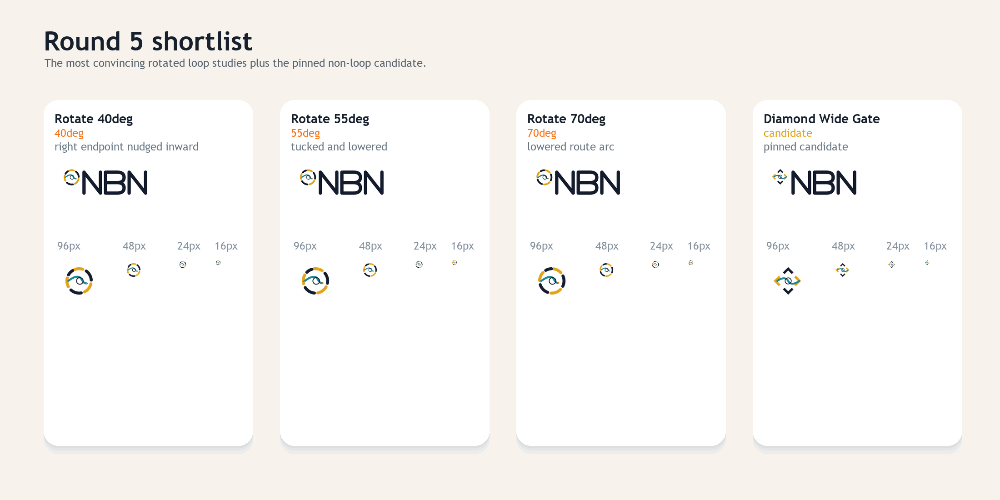

# NBN Logo Exploration Round 5

Round five is a focused `Loop Offset Core` rotation study.

It keeps:

- `Diamond Wide Gate` as a pinned candidate reference
- `Loop Offset Core` as the source mark

It varies:

- the outer ring rotation from `10` through `100` degrees clockwise
- selected route endpoints where the rotated ring makes the exit feel stranded







## Notes

- `Diamond Wide Gate` remains pinned as a non-loop comparison candidate.
- The most convincing loop rotations in this study are `40deg`, `55deg`, and `70deg`.
- The higher rotations need endpoint help; the naive rotation alone starts to dump the route into empty space.

## Regeneration

From the repo root:

```powershell
python docs/branding/round5/generate_assets.py
```
