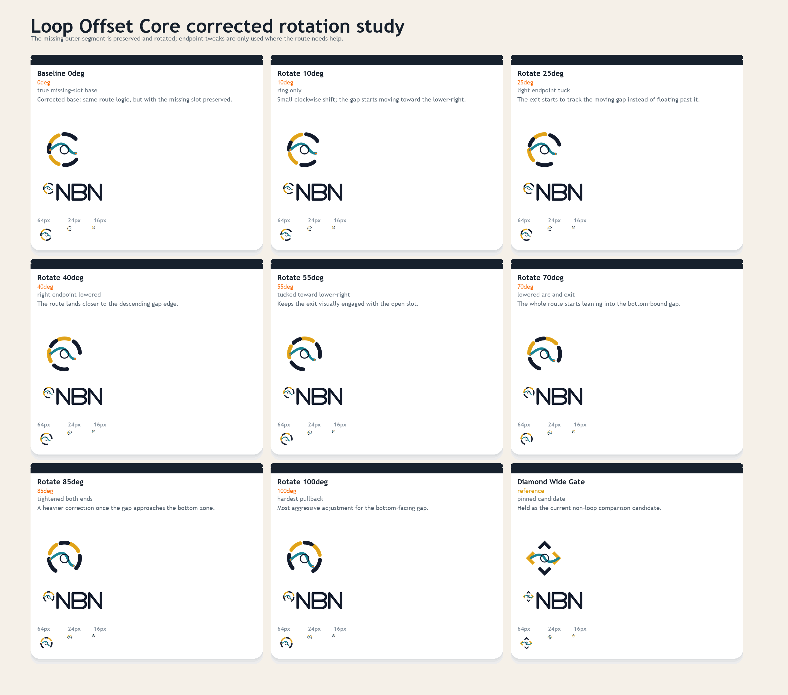
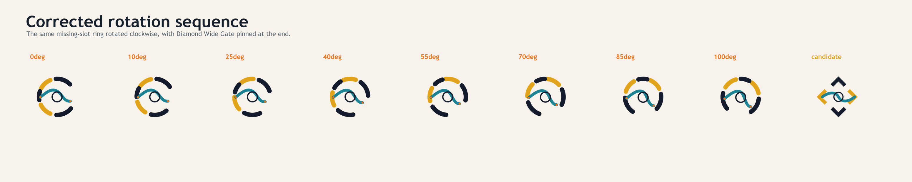
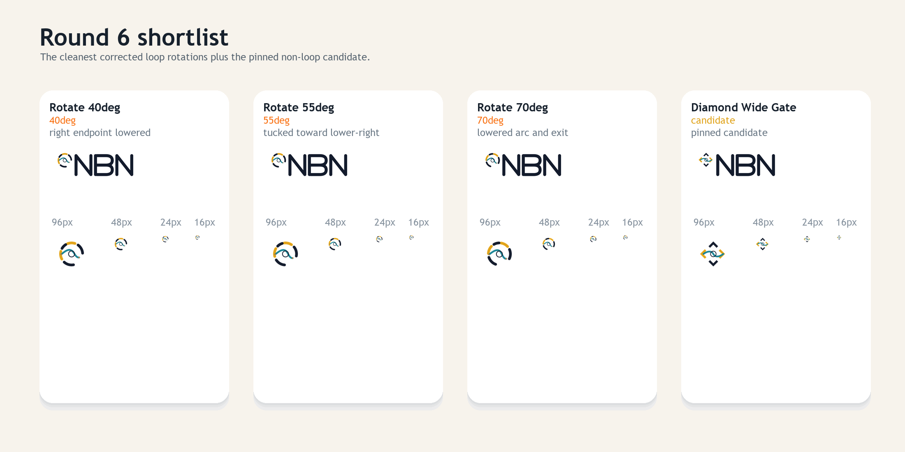

# NBN Logo Exploration Round 6

Round six corrects the previous rotation study.

It keeps:

- the missing outer-ring segment intact
- the original `Loop Offset Core` route / eye logic as the base
- `Diamond Wide Gate` pinned as a non-loop candidate

It varies:

- clockwise rotation of the existing outer-ring pieces only
- selective endpoint adjustments where the route needs to relate to the moving gap







## Notes

- The missing slot is preserved in every loop variant.
- `40deg`, `55deg`, and `70deg` are the cleanest corrected rotations in this pass.
- `Diamond Wide Gate` stays pinned as the non-loop comparison candidate.

## Regeneration

From the repo root:

```powershell
python docs/branding/round6/generate_assets.py
```
