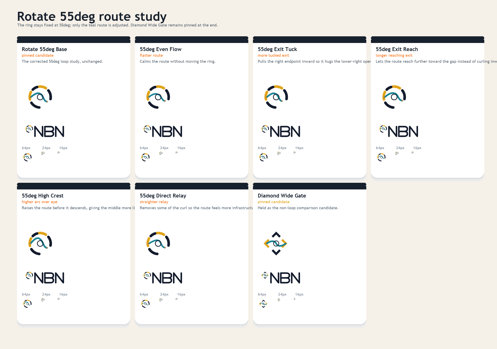
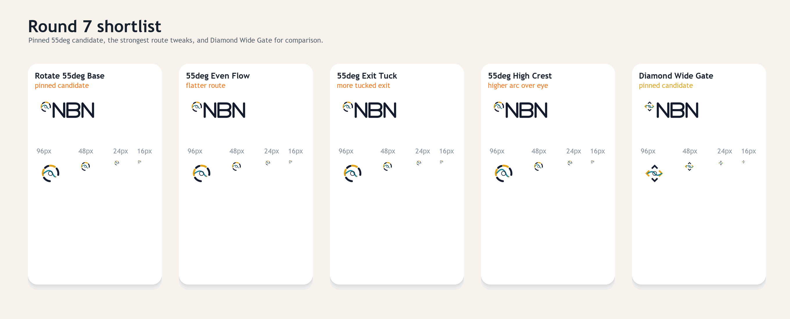

# NBN Logo Exploration Round 7

Round seven keeps the corrected `55deg` loop rotation fixed as a candidate and explores only route variations around it.

Pinned candidates in this round:

- `Rotate 55deg Base`
- `Diamond Wide Gate`





## Variants

- `Rotate 55deg Base`
- `55deg Even Flow`
- `55deg Exit Tuck`
- `55deg Exit Reach`
- `55deg High Crest`
- `55deg Direct Relay`

## Current shortlist

The strongest route treatments in this pass are:

- `Rotate 55deg Base`
- `55deg Even Flow`
- `55deg Exit Tuck`
- `55deg High Crest`

`Diamond Wide Gate` remains pinned for comparison.

## Regeneration

From the repo root:

```powershell
python docs/branding/round7/generate_assets.py
```
