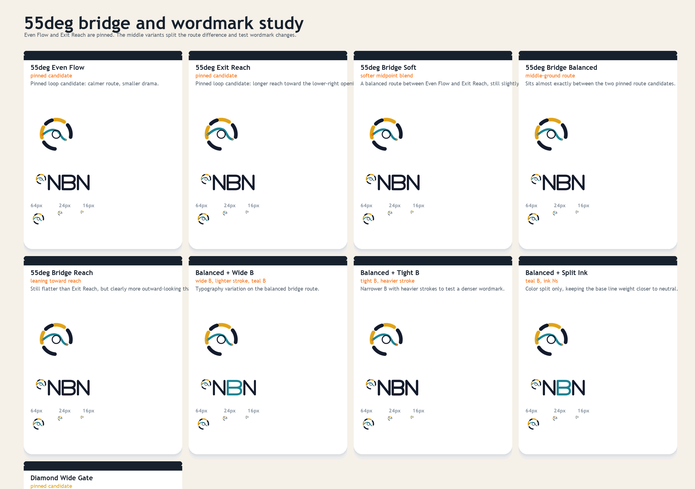
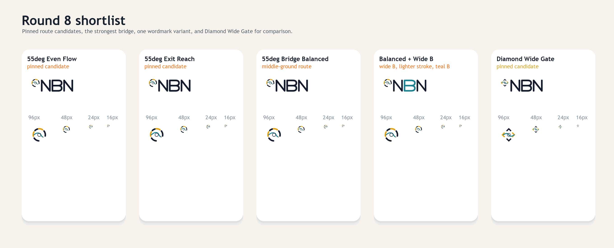

# NBN Logo Exploration Round 8

Round eight keeps the corrected `55deg` ring fixed and does two things:

- pins `55deg Even Flow` and `55deg Exit Reach` as loop candidates
- explores route blends between them, plus a few `NBN` wordmark tweaks

The text experiments focus on:

- stroke weight
- `B` width
- simple ink / teal color splits





## Pinned loop candidates

- `55deg Even Flow`
- `55deg Exit Reach`

## Bridge routes

- `55deg Bridge Soft`
- `55deg Bridge Balanced`
- `55deg Bridge Reach`

## Wordmark experiments

- `Balanced + Wide B`
- `Balanced + Tight B`
- `Balanced + Split Ink`

## Current shortlist

The strongest set in this pass is:

- `55deg Even Flow`
- `55deg Exit Reach`
- `55deg Bridge Balanced`
- `Balanced + Wide B`

`Diamond Wide Gate` remains pinned for comparison.

## Regeneration

From the repo root:

```powershell
python docs/branding/round8/generate_assets.py
```
