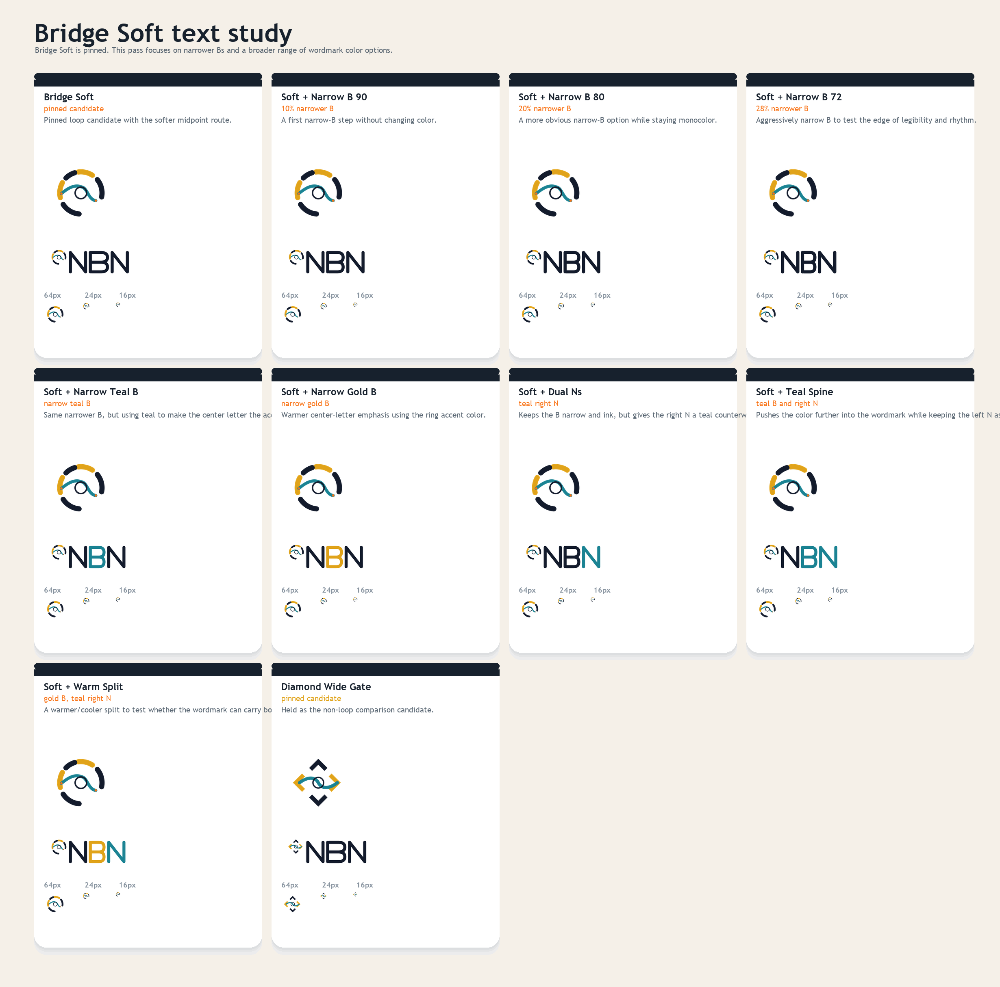
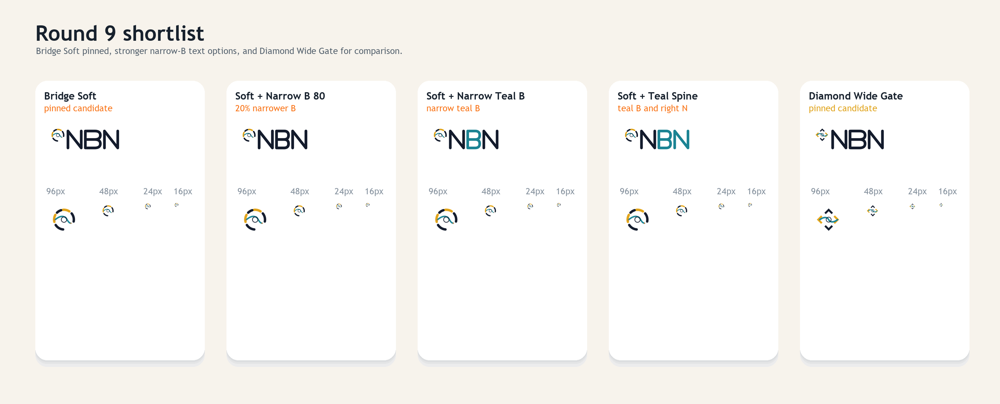

# NBN Logo Exploration Round 9

Round nine keeps `55deg Bridge Soft` pinned as the loop candidate and shifts the study almost entirely into text treatment.

Focus areas:

- narrower `B` widths
- a few stroke-weight shifts
- more `NBN` color options

`Diamond Wide Gate` remains pinned as the non-loop comparison candidate.





## Variants

- `Bridge Soft`
- `Soft + Narrow B 90`
- `Soft + Narrow B 80`
- `Soft + Narrow B 72`
- `Soft + Narrow Teal B`
- `Soft + Narrow Gold B`
- `Soft + Dual Ns`
- `Soft + Teal Spine`
- `Soft + Warm Split`

## Current shortlist

The strongest set in this pass is:

- `Bridge Soft`
- `Soft + Narrow B 80`
- `Soft + Narrow Teal B`
- `Soft + Warm Split`

`Diamond Wide Gate` remains pinned for comparison.

## Regeneration

From the repo root:

```powershell
python docs/branding/round9/generate_assets.py
```
