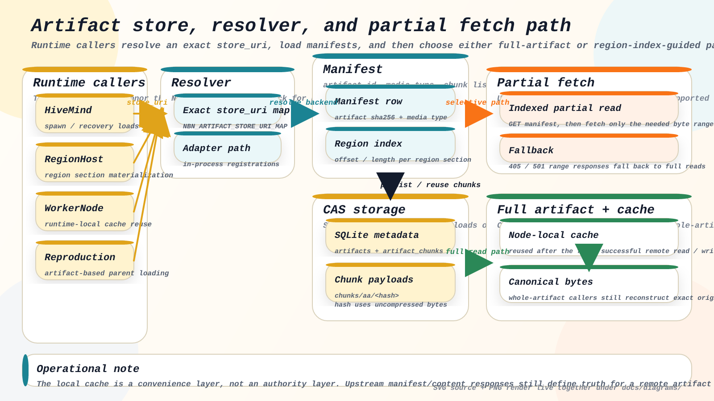

## 16. Artifact storage and deduplication

### 16.1 Goals

* Avoid storing multiple full copies when artifacts are mostly identical (common for repeated spawns and reproduction).
* Support very large artifacts.
* Support partial fetch (region-only and snapshot-only usage).
* Use permissive/free licensing (custom implementation permitted).

### 16.2 Content-addressed chunk store (recommended)

Implement an Artifact Store as a content-addressed storage (CAS) with chunk-level deduplication:

* Each artifact has an `ArtifactId = SHA-256(canonical_bytes)`.
* Artifact payload bytes are split into chunks using **content-defined chunking** (CDC) to improve dedup when insertions shift offsets.

  * Suggested CDC parameters: min 512 KiB, avg 2 MiB, max 8 MiB
* Each chunk stored by `chunk_hash = SHA-256(chunk_bytes)`.

Metadata is stored in SQLite (manifest tables). Chunk payloads stored on disk:

* `chunks/aa/<hash>` where `aa` is first byte of hash in hex.

Compression:

* chunks may (should) be compressed (e.g., zstd) before storage
* compression is chunk-local; hash is computed on uncompressed chunk bytes for correctness
* runtime chunk metadata persists the original byte length, stored byte length, and compression label needed to reopen the chunk stream; those fields are storage metadata and do not participate in chunk identity

### 16.3 Manifest structure

An artifact manifest stores:

* artifact_id
* media_type (`application/x-nbn`, `application/x-nbs`)
* byte_length
* ordered list of chunk hashes with uncompressed sizes
* optional region-section index to support partial fetch

Clients:

* download manifest
* download missing chunks
* reconstruct canonical bytes on demand
* resolve non-file `store_uri` values through a pluggable artifact-store adapter/client path instead of treating them as local filesystem roots
* keep a node-local cache of fetched full artifacts/chunks so repeated loads reuse local bytes after the first fetch
* fail explicitly when no adapter is registered for a non-file `store_uri`; do not silently redirect those reads/writes to a local fallback path
* support a built-in HTTP(S) artifact-service backend in addition to in-process registrations and file-backed stores
* bootstrap exact non-file `store_uri` mappings at process start through `NBN_ARTIFACT_STORE_URI_MAP` (JSON object of `store_uri -> local backing root | file:// URI | HTTP(S) artifact-service base URI`) when an in-process adapter registration path is not available

Example bootstrap mapping:

```json
{
  "memory+prod://artifact-store/main": "D:\\nbn\\artifact-mirror",
  "s3+cache://cluster-a/artifacts": "https://artifact-gateway.cluster-a.internal/"
}
```

Runtime fetch/store callers that honor this resolver path include HiveMind, RegionHost, WorkerNode, and Reproduction. Use exact key matches rather than prefix matching so different logical stores do not alias accidentally.

Built-in HTTP(S) backend contract:

* direct `http://...` / `https://...` `store_uri` values resolve through the built-in client without extra registration
* env-map values that are HTTP(S) URIs resolve through the same client, while non-URI values still resolve as local backing roots
* the service base URI must expose:
  * `GET {base}/v1/manifests/{sha256}` -> manifest JSON
  * `GET {base}/v1/artifacts/{sha256}` -> full canonical bytes
  * `GET {base}/v1/artifacts/{sha256}` with `Range: bytes=start-end` -> exact partial bytes when supported
  * `POST {base}/v1/artifacts` -> raw artifact bytes with artifact media type in `Content-Type`; callers may supply optional region-index metadata via `X-Nbn-Artifact-Region-Index` (base64-encoded JSON array of `{ regionId, offset, length }`)
* transport errors and non-success responses are explicit runtime failures; they do not trigger local-path fallback
* `404` means the requested artifact or manifest is missing from that store
* `405` / `501` on range reads fall back to full-artifact reads; other range failures remain explicit errors

### 16.4 Dedup interactions with plasticity and reproduction

Plasticity:

* `.nbs` stores only buffer state and strength-code overlays, typically much smaller than `.nbn` (at least if re-basing enabled).
* Dedup naturally handles repeated snapshots and similar overlays.

Reproduction:

* regions and axon arrays often share large common chunks
* CDC improves dedup even when new regions/axons shift offsets

### 16.5 Optional region-section indexing (default / if feasible)

The store may additionally index `.nbn` region sections:

* per region: offset and length in canonical bytes
* enables efficient partial fetch of required regions for worker nodes
* may be produced automatically for seekable `.nbn` writes or supplied explicitly by callers that already know the region boundaries
* is an optimization hint only: complete artifact reads remain supported, and indexed reads must still agree with the canonical `.nbn` header directory before a region section is trusted
* auto-produced region indexes are best-effort metadata extraction only: malformed or out-of-range `.nbn` header data skips persisted region-index entries rather than failing the CAS write path by itself
* the built-in HTTP(S) backend issues HTTP `Range` requests when manifest metadata carries a matching region index; if the remote service returns `405`/`501`, callers fall back to full-artifact reads instead of failing solely because range reads are unavailable

Selective reads use a dedicated partial-fetch path; the existing full-artifact open contract remains available for callers that need complete bytes or operate against stores without indexed/range-read support.



_All runtime callers go through the same exact-`store_uri` resolver, then choose full-artifact or region-index-guided partial reads from the manifest._

### 16.6 Retention and maintenance limits

Current artifact-store lifecycle management is append-only:

* storing a distinct artifact writes one `artifacts` row plus ordered `artifact_chunks` references
* storing another artifact that reuses an existing chunk hash increments that chunk row's `ref_count` instead of writing a duplicate chunk payload
* when concurrent writers race on an existing chunk file, later writers tolerate the transient file-present/metadata-missing state by re-reading committed metadata or deriving the storage metadata from the existing chunk bytes before reusing that chunk
* duplicate stores are keyed by `artifact_sha256`; re-storing the same artifact bytes with the same media type reuses the existing manifest/catalog row rather than incrementing those counters again
* later compatible stores may enrich missing region-index metadata on that existing row, but conflicting media-type changes or conflicting region-index entries are rejected explicitly
* there is currently no public delete/release API, no ref-count decrement path, and no automatic GC/TTL eviction for the CAS store or node-local cache

Operators should plan manual/external cleanup for artifact-store roots and node-local cache roots until explicit reclamation tooling exists.

Shared-root note:

* a local CAS root may be shared by multiple processes on one machine; concurrent writers rely on SQLite WAL/busy-timeout behavior plus chunk metadata recovery for duplicate chunk files
* node-local cache roots are still per-process or per-node optimizations, not shared cache-coherence layers; avoid pointing multiple processes or hosts at the same `.cache` root for a remote store
* built-in HTTP(S) backends use the same node-local cache path (`NBN_ARTIFACT_CACHE_ROOT` or `<artifact-root>/.cache`) after the first successful remote fetch/write-through; cache contents are never authoritative over upstream manifest/content responses

---
